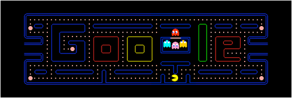

# Créer des pages WEB HTML

## [color=#26B260]A quoi sert le HTML5 ?[/color]


Le HTML5 est le **langage de base**  pour créer un site internet. Le HTML5 sert a **structurer votre contenu**. Même s’il est relativement simple, vous en aurez toujours _besoin_. Donc, que vous vous lanciez dans un petit _site personnel_ ou dans un très gros projet (un peu risqué sans trop de connaissance …), vous devrez utilisez du HTML5.


HTML est un **langage** de balises destiné essentiellement à la présentation des données.  
HTML possède un **ensemble de balises** destinées à :  
-> structurer le document sous forme de titres, de paragraphes, de listes, de tableaux, etc.   
-> formater des données textuelles : emphase, citation, code, ...  
-> définir des aspects visuel : police, taille et couleur des caractères, espacement et placement.  





Apprendre le HTML5 est une **chose**, bien le **maîtriser** en est une autre.  
Le HTML5 est un langage inspiré du _XML_ et qui repose sur le principe de **balises imbriquées**. En résumé, il sert à indiquer au navigateur (internet explorer, firefox, safari …) comment **afficher la page web**. Imaginez que vous vouliez créer un site avec une seule page ou il serait juste écrit : « Bonjour ». Vous allez devoir écrire des lignes de codes _HTML5_ pour indiquer au navigateur d’afficher votre texte.
Comme le HTML5 fonctionne sur le principe de **balises imbriquées**, nous allons encadré notre texte par deux balises : La première pour indiquer le _début_ et la deuxième pour indiquer la _fin_. Pour afficher du texte en HTML5, bien souvent nous utilisons la balise servant à indiquer qu’il s’agit d’un paragraphe. Même pour n’écrire qu’une seule phrase, on utilise cette balise.

Ce qui nous donnera la ligne de code suivant :

```<p>bonjour</p>```

On ouvre une première balise <p> pour indiquer au navigateur qu’il doit afficher le texte qui suit puis on la referme cette balise en ajoutant le symbole / (slash). La balise <p> indique un paragraphe. P signifiant Paragraph en anglais. Tout le texte qui se trouve entre ces deux balises s’affichera à l’écran.

