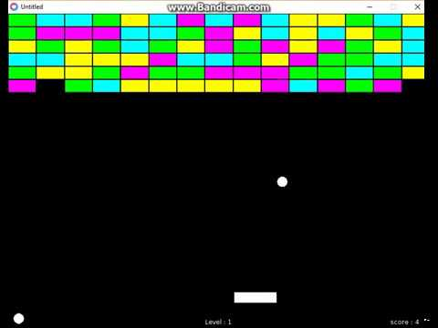

# Créer des pages WEB HTML

## A quoi sert le HTML5? 

Le HTML5 est le **langage de base**  pour créer un site internet. Le HTML5 sert a **structurer votre contenu**. Même s’il est relativement simple, vous en aurez toujours _besoin_. 

HTML est un **langage** de balises destiné essentiellement à la présentation des données.  
HTML possède un **ensemble de balises** destinées à :  
-> structurer le document sous forme de titres, de paragraphes, de listes, de tableaux, etc.   
-> formater des données textuelles : emphase, citation, code, ...  
-> définir des aspects visuel : police, taille et couleur des caractères, espacement et placement.  

Apprendre le HTML5 est une **chose**, bien le **maîtriser** en est une autre.  
Le HTML5 est un langage de **balises imbriquées**. Il sert à indiquer au navigateur comment **afficher la page web**.   
Imaginez que vous vouliez créer un site avec une seule page ou il serait juste écrit : `« Bonjour »`.  
Vous allez devoir écrire des lignes de codes _HTML5_ pour indiquer au navigateur d’afficher votre texte.  
Comme le HTML5 fonctionne sur le principe de **balises imbriquées**, nous allons encadré notre texte par deux balises : La première pour indiquer le _début_ et la deuxième pour indiquer la _fin_. Pour afficher du texte en HTML5, bien souvent nous utilisons la balise servant à indiquer qu’il s’agit d’un paragraphe. Même pour n’écrire qu’une seule phrase, on utilise cette balise.

Ce qui nous donnera la ligne de code suivant :

    
bonjour

On ouvre une première balise `
` pour indiquer au navigateur qu’il doit afficher le texte qui suit puis on la referme cette balise en ajoutant le symbole `/` (slash). La balise `
` indique un paragraphe.` P` signifiant Paragraph en anglais. Tout le texte qui se trouve entre ces deux balises s’affichera à l’écran.

Le HTML5 sert principalement à afficher un contenu (texte, image, vidéo, animation …). Ce contenu est hiérarchisé par des balises.   
Par exemple pour un titre on utilise des balises relatives `(<h1>,<h2>,<h3> …)`, idem pour le texte `(
,<a>` pour faire un lien ….), le multimédia (`` pour les images …).

Chaque balise à une utilisation logique dans la structuration du document. Le choix des balises est primordiale et les moteurs de recherches s’en servent pour classer et positionner vos page web lors de requête. Il est donc très important d’apporter un soin particulier à leur choix. Par exemple, pour une citation, on n’utilise pas une balise 
 (paragraphe) mais une balise <blockquote> (citation). Si le rendu à l’affichage est le même, pour l’interprétation du navigateur mais surtout des moteurs de recherche ce n’est pas du tout pareil.
